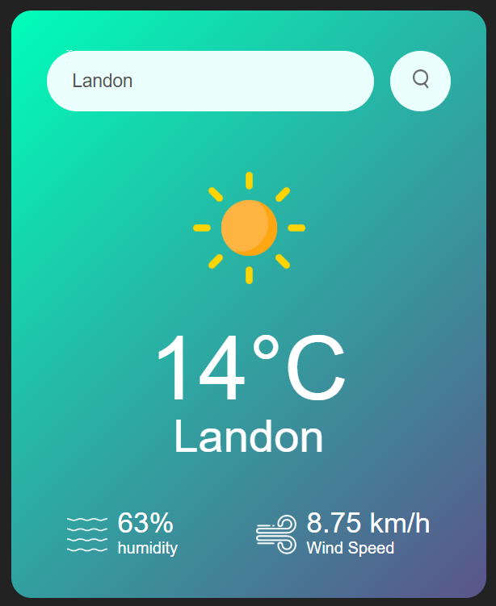

# 🌤 Weather App

A simple **weather application** built using **HTML, CSS, and JavaScript** that fetches real-time weather data from the OpenWeatherMap API. Users can enter a city name and get weather details like temperature, humidity, wind speed, and an appropriate weather icon.

## Demo

[Live Demo](https://charithabimsara.github.io/Weather_Web_Page---JS/)

## 🚀 Features

- 🔍 **Search for any city** to get real-time weather details.
- 🌡️ Displays **temperature, humidity, and wind speed**.
- 🌤 Dynamic **weather icons** based on current weather conditions.
- ❌ **Error handling** for invalid city names.
- 🎨 Responsive and user-friendly **UI design**.

## 🛠 Technologies Used

- **HTML** - Structure of the app.
- **CSS** - Styling for the UI.
- **JavaScript (Vanilla JS)** - Fetching data and updating the UI.
- **OpenWeatherMap API** - Provides real-time weather data.

## 📷 Preview



## 🔧 Setup Instructions

### 1️⃣ Clone the repository
```sh
git clone https://github.com/CharithaBimsara/Weather_Web_Page---JS.git
```

### 2️⃣ Navigate to the project folder
```sh
cd WeatherApp
```

### 3️⃣ Open `index.html` in a browser
You can simply open the `index.html` file in your web browser.

## 🌍 API Integration

This app fetches weather data using the **OpenWeatherMap API**.  
You need an API key to use the service. Get your free API key from [OpenWeatherMap](https://openweathermap.org/).

Replace the API key in `script.js`:
```js
const apiKey = "YOUR_API_KEY_HERE";
```

## 📌 How It Works

1. Enter a **city name** in the search box.
2. Click the **search button** 🔍.
3. The app fetches the weather details from the API.
4. The weather details are displayed on the screen.
5. If an invalid city name is entered, an error message appears.

## 🛠 File Structure
```
WeatherApp/
│── images/                 # Contains all weather-related icons
│   ├── clouds.png
│   ├── drizzle.png
│   ├── humidity.png
│   ├── mist.png
│   ├── rain.png
│   ├── search.png
│   ├── snow.png
│   ├── wind.png
│── index.html              # Main HTML file
│── style.css               # CSS file for styling
│── script.js               # JavaScript file for fetching API data
│── README.md               # Project documentation (this file)
```

## 🤝 Contribution Guidelines

We welcome contributions! To contribute:
1. **Fork** the repository.
2. Create a **new branch**:
   ```sh
   git checkout -b feature-branch-name
   ```
3. Make your changes and **commit**:
   ```sh
   git commit -m "Describe changes made"
   ```
4. **Push** to GitHub:
   ```sh
   git push origin feature-branch-name
   ```
5. Submit a **pull request** for review.

## 📜 License

This project is **free to use** and open-source. Feel free to contribute! 🚀
